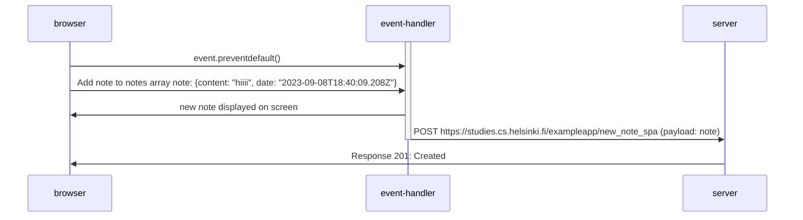

```mermaid
sequenceDiagram
    participant browser
    participant event-handler
    participant server
    

    activate event-handler
    browser ->> event-handler: event.preventdefault()
    browser ->> event-handler: Add note to notes array note: {content: "hiiii", date: "2023-09-08T18:40:09.208Z"}
    
    event-handler ->> browser: new note displayed on screen
    event-handler->>server: POST https://studies.cs.helsinki.fi/exampleapp/new_note_spa (payload: note)
    deactivate event-handler
    
    
    server ->> browser: Response 201: Created               
    
```
